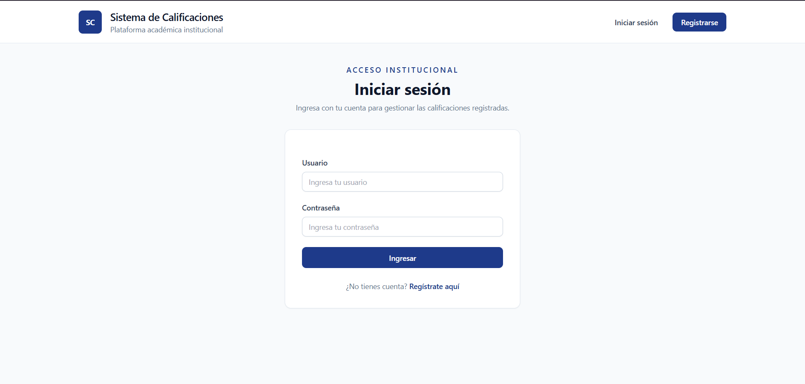
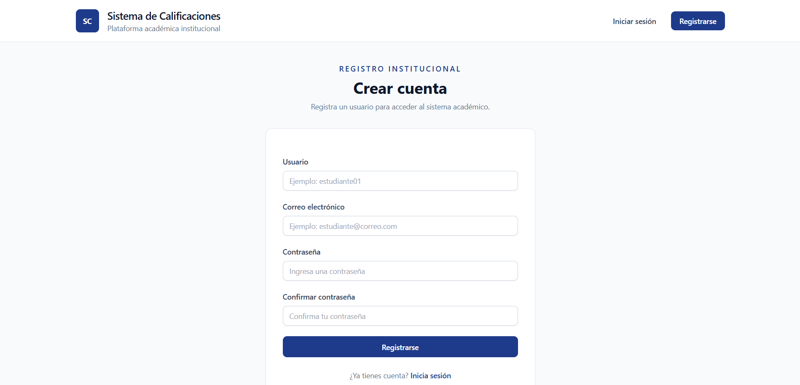
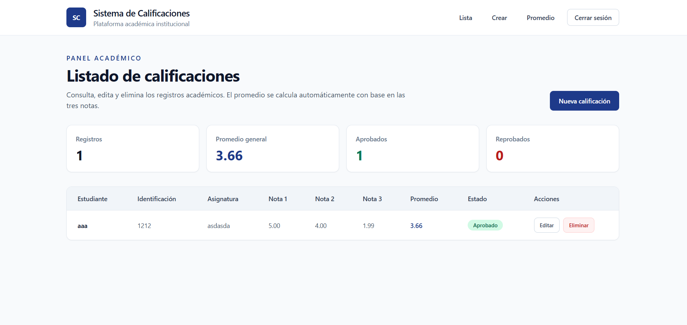
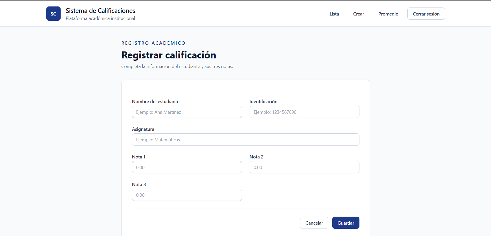
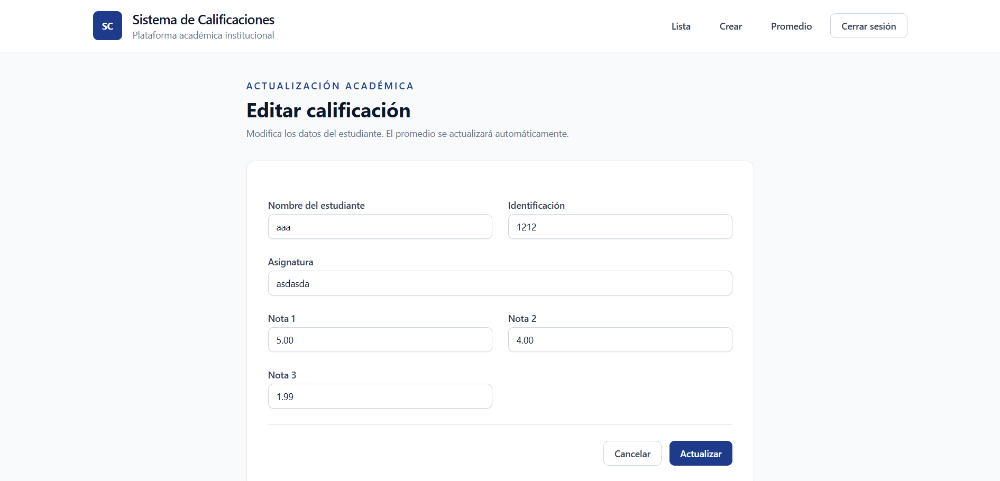
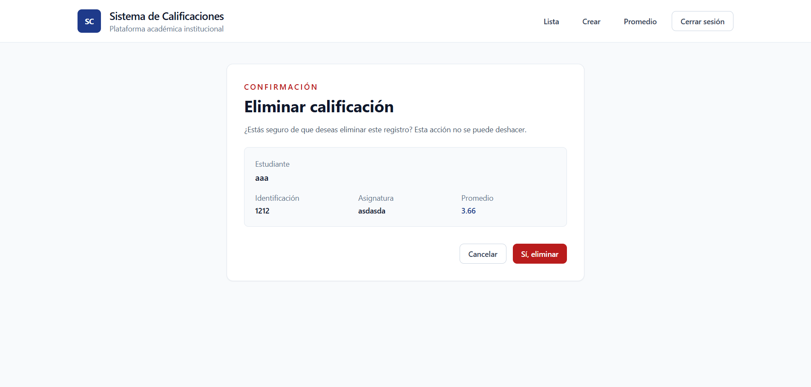
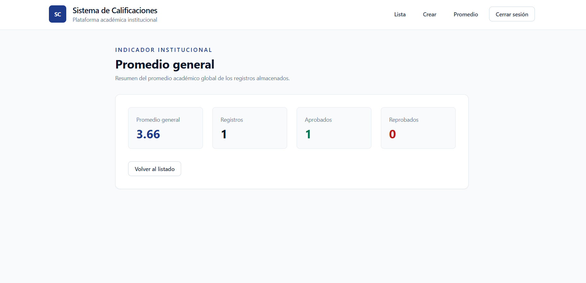
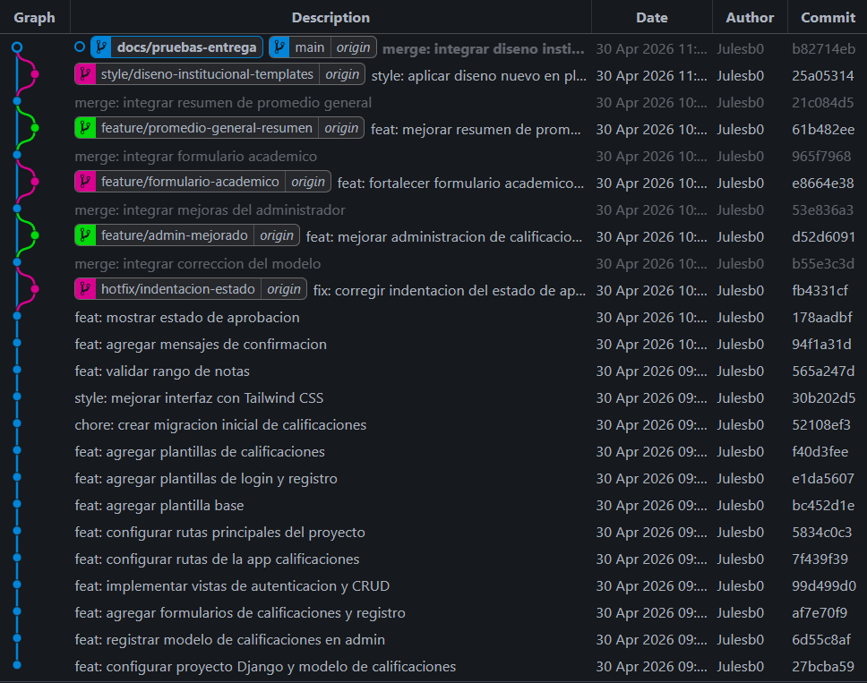

# Pruebas de Funcionamiento

Este documento presenta las pruebas manuales realizadas al sistema de calificaciones desarrollado en Django.

---

## 1. Inicio de sesión

Se verificó que un usuario registrado puede iniciar sesión correctamente desde la ruta `/login/`.

---

## 2. Registro de usuario

Se verificó que el sistema permite registrar nuevos usuarios desde la ruta `/registro/`.

---

## 3. Listado de calificaciones

Se verificó que las calificaciones registradas aparecen en una tabla con sus datos completos.

La tabla muestra:

- Nombre del estudiante.
- Identificación.
- Asignatura.
- Nota 1.
- Nota 2.
- Nota 3.
- Promedio calculado.
- Estado de aprobación.
- Acciones para editar o eliminar.

---

## 4. Crear calificación

Se creó una calificación ingresando:

- Nombre del estudiante.
- Identificación.
- Asignatura.
- Nota 1.
- Nota 2.
- Nota 3.

El sistema calculó automáticamente el promedio antes de guardar el registro.

---

## 5. Editar calificación

Se modificó una calificación existente y se comprobó que el promedio se actualiza automáticamente después de guardar los cambios.

---

## 6. Eliminar calificación

Se probó la eliminación de un registro mediante una página de confirmación.

---

## 7. Promedio general

Se comprobó que la vista `/promedio-general/` muestra el promedio total de los registros usando la función agregada `Avg` de Django.

---

## 8. Validación de notas

Se verificó que el formulario no permite registrar notas menores a `0.0` ni mayores a `5.0`.

---

## 9. Git Graph

Se evidencia el uso de ramas para organizar correcciones, mejoras de presentación, documentación y pruebas del proyecto.

---

## Resultado final

El sistema cumple con:

- Registro de usuarios.
- Inicio de sesión.
- CRUD completo de calificaciones.
- Cálculo automático del promedio individual.
- Cálculo dinámico del promedio general.
- Validación de notas.
- Plantillas claras y funcionales.
- Presentación visual institucional.